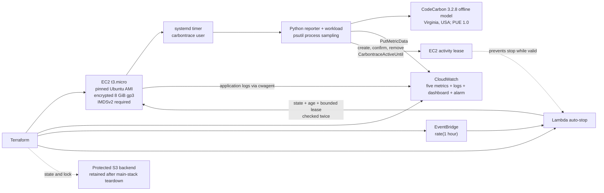

# Carbontrace — AWS Carbon-Footprint Profiler

> **Project status:** The implementation at Git revision `1cb74aa057ea36b9715f50ada168a9d2e3a91aa9` was deployed and validated in `us-east-1`. Four real workload runs published successfully, the natural hourly auto-stop stopped the profiler, and the Terraform-managed main stack was then intentionally destroyed. The protected backend and administrator-managed prerequisites were retained by design.

Carbontrace is a reproducible AWS instrumentation proof of concept. It runs a deliberately inefficient Python workload on one EC2 `t3.micro`, measures process CPU and memory behavior, uses CodeCarbon to **model** energy and CO2e, and publishes five custom metrics plus structured logs to CloudWatch. It demonstrates infrastructure as code, least-privilege IAM boundaries, safe automation, scientific honesty, and verified cleanup.

It is not a physical power meter or a general carbon-accounting product. See the [sanitized final validation report](docs/final-validation-report.md) for the evidence-backed results and limitations.

## What Carbontrace demonstrates

- Terraform-managed EC2, CloudWatch, EventBridge, and Lambda application infrastructure
- administrator-created runtime identities separated from the deployment identity
- a pinned Canonical Ubuntu AMI validated through an exact-ID, Canonical-owner lookup
- encrypted 8 GiB `gp3` root storage and IMDSv2 with hop limit 1
- an unprivileged `carbontrace` application user and `cwagent` CloudWatch Agent user
- a hardened, bounded `systemd` service and timer
- process-scoped CPU and memory sampling
- CodeCarbon 3.2.8 offline energy and CO2e estimation
- lease-aware exact-instance auto-stop with bounded lease values
- saved-plan deployment and teardown discipline
- a read-only post-destroy orphan verifier
- 51 automated regression tests

## Architecture



Terraform read the pre-existing EC2 role, Lambda role, and instance profile as data sources. It did not create or mutate runtime IAM identities. Public IAM documents use `<AWS_ACCOUNT_ID>`; operators must replace that placeholder locally before administrative use.

## Measurements and modeled estimates

The distinction is deliberate:

| Output | Classification | Meaning |
|---|---|---|
| `CPUUtilizationCustom` | Measured | Average process CPU accounting over sampled intervals |
| `MemoryUtilizationPercent` | Measured | Average process memory percentage over sampled intervals |
| `EstimatedEnergyWh` | Modeled estimate | CodeCarbon energy estimate converted from kWh to Wh |
| `EstimatedWatts` | Derived modeled estimate | Modeled Wh divided by elapsed hours |
| `EstimatedCO2Grams` | Modeled estimate | CodeCarbon CO2e estimate converted from kg to grams |

The energy, watts, and CO2e values are **not hardware energy measurements, wall-power readings, or direct electrical measurements**. CPU values can slightly exceed 100% because process CPU accounting can represent execution across logical CPU time; Carbontrace preserves those observations instead of clamping them.

All five metrics use the stable dimensions `Project`, `InstanceType`, and `WorkloadVersion`. `RunId` and the deployed Git revision remain in structured logs to avoid high-cardinality metric dimensions.

| Metric | CloudWatch unit |
|---|---|
| `CPUUtilizationCustom` | `Percent` |
| `MemoryUtilizationPercent` | `Percent` |
| `EstimatedWatts` | `None` |
| `EstimatedEnergyWh` | `None` |
| `EstimatedCO2Grams` | `None` |

CloudWatch has no supported Watts, watt-hours, or grams unit. The modeled metrics therefore use `None`, with semantics carried by their names and dashboard labels.

### CodeCarbon configuration

Every structured run recorded:

- estimator: CodeCarbon
- estimator version: 3.2.8
- tracking mode: `process`
- deployment provider and Region: AWS, `us-east-1`
- offline carbon model: Virginia, USA
- intensity source: CodeCarbon's bundled US-state electricity mix
- effective modeled carbon intensity: 369.13437789074 g CO2e/kWh
- PUE: 1.0

Only `us-east-1` has a reviewed Carbontrace mapping. Unsupported deployment Regions fail closed. PUE 1.0 excludes unverified facility overhead instead of inventing an AWS data-center value. See the [CodeCarbon tracker API](https://docs.codecarbon.io/latest/reference/api/) and [methodology](https://docs.codecarbon.io/3.2/explanation/methodology/).

## Verified final results

The evidence deployment used the immutable revision `1cb74aa057ea36b9715f50ada168a9d2e3a91aa9`.

- cloud-init completed successfully
- the deployed revision matched the expected SHA
- the reporter timer was enabled and active
- the reporter ran as `carbontrace`
- the CloudWatch Agent ran as `cwagent`
- four real runs emitted `measurement_complete`
- four complete five-metric batches emitted `publish_success`
- zero `publish_failure` events were present
- no credential or private-key patterns were detected in the reviewed runtime logs
- activity leases were created, confirmed through `DescribeInstances`, and removed
- every metric had at least three one-minute datapoints
- the dashboard contained exactly five widgets using `Average` and a 300-second period
- EventBridge was enabled at `rate(1 hour)` with exactly one Lambda target

The natural scheduled Lambda invocation—not a manual invocation—recorded this sanitized decision:

```json
{
  "age_seconds": 1270,
  "decision": "stop_requested",
  "previous_state": "running"
}
```

The exact profiler instance was subsequently confirmed stopped.

No AWS console screenshot is published because the retained evidence archive contains machine-readable CLI and log evidence, not an image. No screenshot has been fabricated. The sanitized tables in the [final report](docs/final-validation-report.md) are generated documentation derived from verified evidence, not AWS screenshots.

## Activity-lease-aware auto-stop

Before a published run begins, the reporter writes `CarbontraceActiveUntil` on the exact EC2 instance and confirms the exact value through bounded `DescribeInstances` retries. If visibility is never confirmed, cleanup is attempted and measurement, workload execution, and publication do not start.

The Lambda:

1. validates the configured exact instance ID and bounded environment values;
2. describes that exact instance;
3. skips non-running or recently launched instances;
4. honors a lease only when `now < active_until <= now + 600`;
5. ignores and logs malformed or excessively future-dated leases;
6. repeats the instance and lease check immediately before requesting stop; and
7. calls `StopInstances`, never `TerminateInstances`.

The minimum runtime is 900 seconds. EC2 API clients use standard retries with three total attempts, a three-second connection timeout, and a five-second read timeout.

## Security and cost controls

- SSH ingress accepts one globally routable operator IPv4 `/32`; the address remains private in ignored `terraform.tfvars`.
- There is no public `0.0.0.0/0` ingress rule.
- The instance type is constrained to `t3.micro` and the deployment Region to `us-east-1`.
- The Canonical AMI lookup accepts the exact supplied image ID and only Canonical owner `099720109477`; it does not use `most_recent` or a wildcard name.
- The deployment identity cannot create or alter the runtime roles or instance profile.
- Each runtime role is restricted to its exact operational purpose; neither has `TerminateInstances`.
- The reporter validates metric values before creating the CloudWatch client and fails nonzero on publishing failure.
- Application and Lambda log groups have bounded retention.
- Direct Python dependencies are transitively hash-locked and audited in CI.
- The hourly auto-stop is a circuit breaker, not a substitute for teardown.
- A stopped instance can still incur EBS charges; the verified saved destroy removed the main stack.

## Tests and CI

The final implementation contains 51 unit tests covering workload validation, metric contracts, failure behavior, lease visibility, lease bounds, auto-stop decisions, IAM policy semantics and size, bootstrap rendering, AMI pinning, and post-destroy verification.

The supported local test command is:

```bash
.venv/bin/python -m unittest discover -s tests -v
```

The repository is configured around `unittest`, not `pytest`; no pytest result is claimed.

The GitHub Actions workflow runs:

- hash-locked dependency installation
- `pip check`
- `pip-audit`
- all Python unit tests
- focused IAM and bootstrap regressions
- Terraform formatting, offline initialization, and validation for both modules
- a tracked-diff guard after Terraform initialization

The documentation release branch remains local until human review, so no new remote CI result is claimed here.

## Verified teardown

The deployment used reviewed, checksummed saved plans for both apply and destroy. The saved destroy application reported:

```text
Apply complete! Resources: 0 added, 0 changed, 10 destroyed.
```

It removed the dashboard, EventBridge rule and target, application and Lambda log groups, Lambda error alarm, EC2 instance, Lambda function, Lambda invoke permission, and security group. Terraform state then contained zero managed resources.

The read-only verifier reported clear results for EC2 instances, EBS volumes, security groups, network interfaces, both log groups, Lambda, EventBridge, Lambda permission, alarm, and dashboard:

```text
Post-destroy verification passed: no main-stack resources remain.
```

The protected versioned S3 backend, runtime roles, instance profile, deployment identity and policies, EC2 key pair, and operator-local PEM were intentionally retained because they are prerequisites outside the main stack.

## Reproduction workflow

Reproduction is intentionally gated. Do not treat these commands as authorization to deploy.

1. Create the protected backend and administrator-managed runtime identities.
2. Replace `<AWS_ACCOUNT_ID>` in the public IAM/backend templates locally.
3. Copy the example variables into ignored private files and provide the account ID, operator `/32`, key-pair name, pinned AMI, and reviewed 40-character application revision.
4. Initialize with the private backend configuration.
5. create a binary saved plan, inspect `terraform show`, and record its SHA-256;
6. apply only that reviewed saved plan;
7. collect and sanitize runtime evidence; and
8. create, inspect, checksum, and apply only a saved destroy plan, then run the read-only orphan verifier.

```bash
cp terraform.tfvars.example terraform.tfvars
cp backend.hcl.example backend.hcl
terraform init -backend-config=backend.hcl -lockfile=readonly
terraform fmt -check -recursive
terraform validate
terraform plan -out=main.tfplan
terraform show main.tfplan
shasum -a 256 main.tfplan
terraform apply main.tfplan

terraform plan -destroy -out=destroy.tfplan
terraform show destroy.tfplan
shasum -a 256 destroy.tfplan
terraform apply destroy.tfplan

AWS_PROFILE=carbontrace AWS_REGION=us-east-1 \
  .venv/bin/python scripts/verify_post_destroy.py
```

Raw evidence, plans, state, private variables, backend configuration, keys, audit output, and deployment transcripts are ignored and must never be committed. `aws_account_id` is intentionally required in both Terraform modules; the public repository contains no deployment-account default.

## Evidence and limitations

The raw local evidence archive is intentionally excluded from Git. Its verified SHA-256 is:

```text
4375ea6599a60338d50aa68a25418cc36fae6c549fd73ae3519c51cced75619a
```

The completed `post-destroy-verification.txt` file independently hashes to `3a34622d3ef4f8053ed5ed9c23b9adf8b9fd31df96ba173db88242059a5f465f`; that digest and the archive digest are recorded and verified in the ignored local `evidence/SHA256SUMS` manifest. The transcript's displayed `88afcb3b…` value is an intermediate digest calculated before the checksum output was appended back into the same file with `tee -a`. It does not authenticate the completed file.

Additional limitations include the single Region and instance type, CodeCarbon model uncertainty, PUE 1.0 excluding facility overhead, default-VPC/public-IPv4 deployment, host variability, and the lack of a retained dashboard screenshot.

## Future direction

The deliberately inefficient loop is a controlled baseline. A future phase can replace it with a real model-inference workload while keeping the same measurement boundaries, metric schema, scientific caveats, dashboard, activity lease, and teardown controls.
