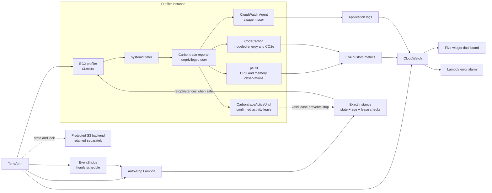

# Carbontrace

[](https://github.com/Mukeshkr-19/Carbontrace/actions/workflows/ci.yml)

Carbontrace is a secure, Terraform-managed AWS workload profiler that observes process CPU and memory usage, derives modeled energy and carbon estimates with CodeCarbon, publishes telemetry to CloudWatch, and automatically stops its EC2 profiler when no validated workload lease is active.

**Status:** Implementation and AWS runtime validation completed successfully. The temporary Terraform-managed main stack was intentionally destroyed after evidence collection; the protected state backend and administrator-managed prerequisites were retained by design.

## Why Carbontrace

Cloud workloads expose CPU and memory telemetry, but they do not normally expose direct hardware power readings. Carbontrace explores how to build an honest, reproducible bridge between workload behavior and estimated energy or carbon impact without presenting modeled values as physical measurements.

The project brings together:

- Terraform infrastructure and remote-state design
- AWS IAM least privilege and deployment/runtime identity separation
- EC2 bootstrap, immutable source revisions, and hardened `systemd` execution
- Python process instrumentation with psutil
- CodeCarbon energy and CO2e estimation
- CloudWatch custom metrics, logs, dashboards, and alarms
- EventBridge and Lambda operational safety automation
- evidence-driven deployment validation and teardown verification

## Architecture



Terraform managed the temporary EC2, CloudWatch, EventBridge, and Lambda resources. It read pre-existing runtime roles and the EC2 instance profile rather than creating or modifying those identities. The protected backend remained outside the temporary main-stack teardown.

## What It Measures and Estimates

| Metric | Type | CloudWatch unit | Meaning |
|---|---|---|---|
| `CPUUtilizationCustom` | Process observation | `Percent` | Average sampled process CPU utilization |
| `MemoryUtilizationPercent` | Process observation | `Percent` | Average sampled process memory utilization |
| `EstimatedWatts` | Modeled estimate | `None` | Average modeled power derived from estimated energy and duration |
| `EstimatedEnergyWh` | Modeled estimate | `None` | CodeCarbon energy estimate converted to watt-hours |
| `EstimatedCO2Grams` | Modeled estimate | `None` | CodeCarbon CO2e estimate converted to grams |

CPU and memory are operating-system process observations. Energy, watts, and CO2e are CodeCarbon-based modeled estimates—not hardware power-meter, wall-power, or direct electrical measurements.

Process CPU accounting can slightly exceed 100% when execution spans logical-processor time. Carbontrace preserves those observations rather than silently clamping them.

Every metric uses the stable dimensions `Project`, `InstanceType`, and `WorkloadVersion`. Run IDs and immutable source revisions stay in structured logs to avoid high-cardinality metric dimensions.

## Key Engineering Features

### Infrastructure and identity

- one Terraform-managed EC2 `t3.micro` in `us-east-1`
- exact-ID Ubuntu AMI lookup restricted to Canonical owner `099720109477`
- encrypted 8 GiB `gp3` root volume
- IMDSv2 required with response hop limit 1
- SSH ingress restricted to one operator-supplied public IPv4 `/32`, stored only in ignored local configuration
- protected S3 backend with native lockfile support
- deployment identity separated from administrator-managed runtime identities
- public IAM templates use `<AWS_ACCOUNT_ID>`; private deployment values remain untracked

### Runtime hardening

- application runs as the unprivileged `carbontrace` user
- CloudWatch Agent runs separately as `cwagent`
- immutable Git revision verified after checkout
- hash-locked Python dependencies
- hardened `systemd` oneshot service and recurring timer
- bounded AWS retries, connection timeouts, and read timeouts
- structured `measurement_complete`, `publish_success`, and `publish_failure` events

### Operational safety

- Lambda receives and evaluates one exact EC2 instance ID
- instance state and launch age are checked before stop
- the lease is evaluated twice to reduce race risk
- active leases are bounded to a 600-second maximum horizon
- malformed or excessively future-dated leases cannot suppress shutdown indefinitely
- the natural hourly schedule stops rather than terminates the instance
- a read-only verifier checks for main-stack resources after teardown

### Scientific transparency

- CodeCarbon 3.2.8 offline estimator
- process-scoped tracking
- AWS `us-east-1` deployment metadata
- Virginia, USA bundled electricity-mix model
- effective modeled intensity recorded with every run
- explicit PUE 1.0, excluding unverified facility overhead
- unsupported AWS Regions fail closed until their methodology is reviewed

## Validation Results

| Validation | Result |
|---|---|
| Automated regression suite | 51 tests passed |
| Real workload publications | 4 successful runs |
| Publication failures | 0 |
| Custom CloudWatch metrics | 5, each with datapoints |
| Dashboard | 5 validated widgets |
| EventBridge | Enabled hourly rule with 1 Lambda target |
| Natural auto-stop | Correct EC2 instance stopped after safety checks |
| Terraform teardown | Exactly 10 managed resources destroyed |
| Terraform state after teardown | 0 managed resources |
| Post-destroy verification | No main-stack resources remained |

The scheduled EventBridge invocation—not a manual Lambda invocation—produced a structured `decision: stop_requested` result, and the exact profiler instance was subsequently confirmed stopped.

See the [final validation report](docs/validation-report.md) for evidence methodology, run data, final SHA-256 values, teardown details, and limitations.

## Auto-Stop Safety Design

1. The reporter creates `CarbontraceActiveUntil` on the exact profiler instance.
2. It confirms the exact tag value through bounded `DescribeInstances` retries.
3. Measurement and workload execution begin only after visibility is confirmed.
4. The reporter removes the lease after the run.
5. EventBridge invokes the auto-stop Lambda hourly.
6. Lambda validates the configured instance ID, running state, launch age, and bounded lease.
7. Lambda repeats the state and lease check immediately before requesting `StopInstances`.
8. The instance is stopped only when no valid active workload lease protects it.

If lease confirmation fails, the reporter attempts cleanup and does not start measurement, workload execution, or metric publication.

## Repository Layout

```text
Carbontrace/
├── app/                         # Workload and metrics reporter
├── bootstrap/                   # Backend module and administrator-reviewed IAM templates
├── docs/
│   ├── README.md                # Documentation index
│   ├── product-requirements.md  # Requirements, decisions, and completion record
│   └── validation-report.md     # Sanitized runtime and teardown evidence
├── lambda/                      # Exact-instance auto-stop function
├── scripts/                     # Bootstrap template and read-only cleanup verifier
├── tests/                       # Automated regression suite
├── .github/workflows/           # Continuous integration
├── *.tf                         # Main Terraform root module
├── README.md
└── requirements.txt
```

The root Terraform files intentionally remain together because they form one conventional Terraform root module.

## Local Verification

The repository uses `unittest`, not pytest.

```bash
.venv/bin/python -m unittest discover -s tests -v
.venv/bin/python -m pip check
.venv/bin/python -m pip_audit -r requirements.txt
terraform fmt -check -recursive
terraform validate
terraform -chdir=bootstrap validate
```

CI performs the corresponding dependency, Python, IAM, bootstrap, formatting, and Terraform checks.

## Deployment Workflow

The AWS main stack is not currently deployed. A future reproduction should be an explicitly reviewed operation, not an automatic consequence of cloning the repository.

At a high level:

1. Create the protected backend and administrator-managed runtime identities.
2. Copy the example configuration into ignored local files.
3. Replace account, network, key-pair, AMI, backend, and revision placeholders locally.
4. Validate the bootstrap and main Terraform modules.
5. Create a binary saved deployment plan.
6. Inspect the rendered plan and record its checksum.
7. Apply only that reviewed saved plan.
8. Validate runtime identity, metrics, logs, dashboard, activity leases, and auto-stop.
9. Create, inspect, checksum, and apply only a saved destroy plan.
10. Confirm empty Terraform state and run the read-only post-destroy verifier.

Start with [`terraform.tfvars.example`](terraform.tfvars.example), [`backend.hcl.example`](backend.hcl.example), and the [runtime identity guide](bootstrap/runtime-roles/README.md). Never commit private variables, backend configuration, state, saved plans, credentials, keys, or raw evidence.

## Current Status

- engineering implementation complete
- automated and AWS runtime validation complete
- evidence collected and sanitized
- temporary Terraform-managed main stack intentionally destroyed
- no main-stack resources found by the post-destroy verifier
- protected backend and administrator-managed prerequisites retained intentionally

## Documentation

- [Documentation index](docs/README.md)
- [Product requirements and completion record](docs/product-requirements.md)
- [Final validation and teardown report](docs/validation-report.md)

## Known Limitations

- energy, watts, and CO2e remain modeled estimates rather than physical measurements
- validation covered one AWS Region, one EC2 instance type, and a short synthetic workload
- PUE is fixed at 1.0 and excludes facility overhead
- no AWS dashboard screenshot was retained
- no standalone pre-destroy alarm-state snapshot exists
- historical Git revisions may contain earlier account-specific examples

The raw evidence archive remains intentionally excluded from Git. Evidence integrity, final SHA-256 values, and the historical transcript-checksum caveat are documented in the [validation report](docs/validation-report.md).

## Future Direction

The bounded synthetic workload provides a controlled baseline. It can be replaced with a model-inference workload while preserving the same metric contract, activity-lease protection, estimator disclosures, and teardown controls.
