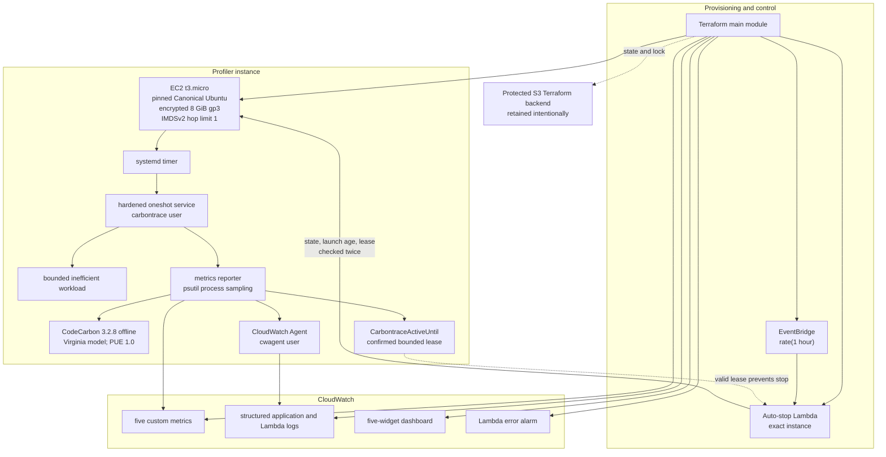

# Carbontrace final validation and teardown report

**Report date:** 2026-07-15<br>
**Validated implementation revision:** `1cb74aa057ea36b9715f50ada168a9d2e3a91aa9`<br>
**Deployment Region:** AWS `us-east-1`<br>
**Publication status:** Sanitized documentation; raw evidence remains local and untracked

## Executive summary

Carbontrace was deployed from the exact immutable revision above, validated through four real workload runs, naturally stopped by its hourly EventBridge/Lambda circuit breaker, and then removed through a reviewed saved Terraform destroy plan.

The deployment produced five CloudWatch custom metrics and structured application logs. All four observed metric batches published successfully; no publication failure was present. The dashboard had exactly five widgets, and every widget used the `Average` statistic with a 300-second period. The natural Lambda event requested a stop after 1270 seconds, and the exact instance was later observed in the stopped state.

The destroy applied only the reviewed saved plan and removed ten main-stack resources. Terraform state contained zero managed resources afterward, and the read-only orphan verifier reported every main-stack category clear. The protected S3 backend and administrator-managed prerequisites were intentionally retained.

This report does not publish raw AWS JSON, ARNs, account IDs, request IDs, resource IDs, IP addresses, plans, state, keys, or credentials.

## Evidence basis and integrity

The archive was extracted only under `/tmp/carbontrace-final-evidence`. Nothing from the raw archive was copied into the repository.

| Local evidence | Observed SHA-256 | Integrity result | Public use |
|---|---|---|---|
| `evidence/carbontrace-final-evidence.tar.gz` | `4375ea6599a60338d50aa68a25418cc36fae6c549fd73ae3519c51cced75619a` | Matches the supplied checksum | Sanitized facts and tables only |
| `evidence/post-destroy-verification.txt` | `3a34622d3ef4f8053ed5ed9c23b9adf8b9fd31df96ba173db88242059a5f465f` | Independently hashed as the completed file; recorded and verified in ignored `evidence/SHA256SUMS` | Substantive clear/retained output summarized |

The transcript's displayed `88afcb3b0b63fdaab5c17a3bef06984412950fe3fb2ea4bf28b2f95206547526` value was calculated before the checksum output was appended back into the file with `tee -a`. It is therefore an intermediate pre-append digest and is not claimed to authenticate the completed transcript. The historical transcript remains byte-for-byte unchanged.

The archive contains EventBridge rule/target evidence, final EC2 state, five metric extracts, application events, Lambda events, a selected stop event, and dashboard inventory. It contains no image. Accordingly, no AWS console screenshot is claimed.

## Final architecture



## Implementation controls

### Compute and bootstrap

- one Terraform-managed EC2 `t3.micro`
- required exact AMI ID resolved only through Canonical owner `099720109477`
- no `most_recent` or wildcard image-name lookup
- encrypted 8 GiB `gp3` root volume, deleted on termination
- IMDSv2 required; response hop limit 1; instance metadata tags disabled
- immutable Git checkout verified against `1cb74aa057ea36b9715f50ada168a9d2e3a91aa9`
- hash-locked Python dependencies
- signed, version-pinned CloudWatch Agent installation
- `carbontrace` application user and `cwagent` telemetry user
- hardened `systemd` service with a five-minute timeout

### IAM and network separation

- the deployment identity could read/pass, but not create or mutate, runtime roles
- EC2 lease mutation was limited to `CarbontraceActiveUntil` on the tagged profiler
- EC2 `DescribeInstances` was Region-limited and read-only
- Lambda could describe and stop only according to the reviewed exact-instance/tag design
- neither runtime policy granted `TerminateInstances`
- SSH ingress was restricted to one private operator `/32`; the address is not published
- public templates use `<AWS_ACCOUNT_ID>`, `<INSTANCE_ID>`, and similar placeholders

## Carbon methodology and scientific boundaries

### Measurements versus estimates

| Value | Source | Classification |
|---|---|---|
| process CPU percentage | psutil one-second process samples | measurement |
| process memory percentage | psutil one-second process samples | measurement |
| energy in Wh | CodeCarbon estimated kWh converted to Wh | modeled estimate |
| average watts | modeled Wh divided by recorded elapsed hours | derived modeled estimate |
| CO2e in grams | CodeCarbon estimated kg CO2e converted to grams | modeled estimate |

Energy, watts, and CO2e are not physical EC2 meter readings, wall-power measurements, or direct electrical measurements. They should be used for controlled comparisons under the same pinned environment and method.

CPU averages above 100% are valid observations for this process-accounting method because logical CPU execution time can exceed one single-core equivalent. The values were preserved and not clamped.

### Recorded estimator configuration

| Field | Verified value |
|---|---|
| estimator | CodeCarbon |
| version | 3.2.8 |
| tracking mode | process |
| cloud provider | AWS |
| deployment Region | us-east-1 |
| carbon country | USA |
| carbon region | Virginia |
| source | CodeCarbon bundled offline US-state energy mix |
| modeled intensity | 369.13437789074 g CO2e/kWh |
| PUE | 1.0 |

PUE 1.0 intentionally excludes unknown data-center overhead. The Virginia mix is a stable bundled approximation, not live grid data and not an AWS facility-specific intensity.

## Runtime validation

### Four successful workload runs

Values below are selected, sanitized evidence values. Numeric presentation is rounded for readability; no identifier or unpublished datapoint was invented.

| Start time (UTC) | Average CPU % | Average memory % | Estimated energy Wh | Estimated average W | Estimated CO2e g | Publish |
|---|---:|---:|---:|---:|---:|---|
| 2026-07-15 15:41:16 | 102.1103 | 13.6681 | 0.496979 | 59.6296 | 0.183452 | success |
| 2026-07-15 15:42:33 | 101.7750 | 11.3735 | 0.476938 | 57.2274 | 0.176054 | success |
| 2026-07-15 15:43:11 | 102.1655 | 13.5960 | 1.007527 | 120.8977 | 0.371913 | success |
| 2026-07-15 15:43:47 | 102.3517 | 13.6066 | 0.651065 | 78.1177 | 0.240330 | success |

Application evidence totals:

| Structured event | Count |
|---|---:|
| `measurement_complete` | 4 |
| `publish_success` | 4 |
| `publish_failure` | 0 |

All four measurement records carried the expected Git revision and the same explicit methodology configuration.

### CloudWatch metric contract

| Metric | Unit | Evidence |
|---|---|---|
| `CPUUtilizationCustom` | `Percent` | at least three one-minute datapoints |
| `MemoryUtilizationPercent` | `Percent` | at least three one-minute datapoints |
| `EstimatedWatts` | `None` | at least three one-minute datapoints |
| `EstimatedEnergyWh` | `None` | at least three one-minute datapoints |
| `EstimatedCO2Grams` | `None` | at least three one-minute datapoints |

The stable dimensions were `Project`, `InstanceType`, and `WorkloadVersion`. Metric names, dimensions, and timestamps were not altered for publication.

### Dashboard, logs, schedule, and alarm

| Control | Verified result |
|---|---|
| dashboard widget count | exactly 5 |
| widget statistic | `Average` for all widgets |
| widget period | 300 seconds for all widgets |
| application log publication | 4 successes, 0 failures |
| EventBridge rule | enabled, `rate(1 hour)` |
| EventBridge targets | exactly 1 Lambda target |
| Lambda error alarm | present in Terraform and removed by destroy; no standalone pre-destroy alarm-state snapshot in archive |

The archive does not include a dashboard screenshot. The tables above are generated evidence visualizations, not AWS console screenshots.

## Natural auto-stop proof

The reporter's activity lease was created on the exact instance, confirmed visible before work, and removed afterward. The Lambda accepted only a current numeric lease no more than 600 seconds into the future and repeated the describe/lease evaluation before stopping.

The natural EventBridge invocation recorded:

```json
{
  "age_seconds": 1270,
  "decision": "stop_requested",
  "previous_state": "running"
}
```

The final instance-state evidence recorded `stopped`, `t3.micro`, IMDSv2 `required`, metadata hop limit `1`, and EBS root storage.

## Saved-plan discipline

The official workflow completed eight gated phases:

| Phase | Outcome |
|---|---|
| A. Account and cost safety | account, Region, and cost boundaries reviewed |
| B. Runtime identities | administrator-managed EC2/Lambda identities established |
| C. Deployment permissions | permanent scoped deployment/backend policies established |
| D. Key and private variables | operator inputs retained only in private ignored files |
| E. Backend and deployment plan | initialized backend; saved plan reviewed and checksummed |
| F. Deployment | only the reviewed saved plan applied |
| G. Runtime evidence | bootstrap, runs, metrics, logs, dashboard, lease, and auto-stop validated |
| H. Destroy and cleanup | saved destroy reviewed/checksummed/applied; orphan verifier passed |

No plan, state, backend file, private variable, key, or raw transcript is included in this documentation change.

## Terraform teardown

The reviewed saved destroy application reported:

```text
Apply complete! Resources: 0 added, 0 changed, 10 destroyed.
```

Removed resources:

1. `aws_cloudwatch_dashboard.carbontrace`
2. `aws_cloudwatch_event_rule.auto_stop[0]`
3. `aws_cloudwatch_event_target.auto_stop[0]`
4. `aws_cloudwatch_log_group.application`
5. `aws_cloudwatch_log_group.auto_stop[0]`
6. `aws_cloudwatch_metric_alarm.auto_stop_errors[0]`
7. `aws_instance.profiler`
8. `aws_lambda_function.auto_stop[0]`
9. `aws_lambda_permission.allow_eventbridge[0]`
10. `aws_security_group.instance`

Terraform state contained zero managed resources afterward.

## Post-destroy orphan verification

The read-only verifier reported clear:

- EC2 instances
- EBS volumes
- security groups
- network interfaces
- application and Lambda log groups
- Lambda function
- EventBridge rule and targets
- Lambda invocation permission
- CloudWatch alarm
- CloudWatch dashboard

Its final substantive result was:

```text
Post-destroy verification passed: no main-stack resources remain.
```

Intentionally retained prerequisites:

- protected, versioned Terraform backend bucket and object versions
- EC2 runtime IAM role
- Lambda runtime IAM role
- EC2 instance profile
- deployment identity and backend/deployment policies
- EC2 key pair
- operator-local PEM file

These retained prerequisites are not main-stack orphans.

## Tests and release checks

The implementation revision contains 51 automated tests covering:

- workload input validation
- metric validation and CloudWatch contract
- publish success and failure semantics
- CodeCarbon methodology metadata
- activity-lease confirmation and cleanup
- bounded Lambda lease handling and exact-instance stop logic
- AMI pinning and bootstrap hardening
- IAM semantics and compact policy size
- read-only cleanup verification

The repository CI definition additionally checks hash-locked dependencies with `pip check` and `pip-audit`, Terraform formatting and validation for both modules, and a clean tracked diff after initialization. This documentation branch is intentionally not pushed, so no remote CI result is asserted.

Local release-preparation results:

| Check | Result |
|---|---|
| repository-supported Python suite (`.venv/bin/python -m unittest discover -s tests -v`) | 51/51 passed |
| focused IAM policy regressions | 6/6 passed |
| focused bootstrap/systemd regressions | 8/8 passed |
| `terraform fmt -check -recursive` | passed |
| root offline `terraform init -backend=false -lockfile=readonly` | passed |
| root `terraform validate` | passed |
| bootstrap offline initialization | passed |
| bootstrap validation | passed |
| `pip check` | no broken requirements |
| `pip-audit 2.10.1 -r requirements.txt` | no known vulnerabilities reported |
| `git diff --check` | passed |
| publication pattern scan | no access keys, private-key blocks, AWS credential assignments, Sanjay-specific account ID, unrelated local artifacts, or tracked private files found |

The project does not declare `pytest`; its supported command is `.venv/bin/python -m unittest discover -s tests -v`, the 51-test discovery command used by CI. The starting CI workflow has no dedicated secret-scanning action, so release preparation used explicit current-tree credential, private-key, identifier, metadata, and forbidden-artifact scans. Remote CI must still run after a human-approved push.

## Reproduction notes

A future reproduction must use a different private deployment context and repeat the A–H gates. Public templates require local replacement of `<AWS_ACCOUNT_ID>`; operator IPs, keys, backend values, state, plans, and credentials must remain ignored.

The critical sequence is:

1. prepare protected backend and runtime identities;
2. validate permanent deployment permissions;
3. prepare ignored private inputs;
4. initialize and validate both Terraform modules;
5. create, inspect, and checksum a saved deployment plan;
6. apply only the reviewed saved plan;
7. collect and sanitize runtime evidence;
8. create, inspect, checksum, and apply only a saved destroy plan;
9. confirm zero state resources and run the read-only orphan verifier.

## Known limitations and open gaps

- CodeCarbon results are modeled estimates and inherit model, hardware, sampling, and electricity-data uncertainty.
- PUE 1.0 excludes data-center facility overhead.
- The experiment covers one Region, one instance type, one short synthetic workload, and four runs.
- The default-VPC design and public SSH path are appropriate only for this bounded demonstration.
- No dashboard screenshot was retained; none is fabricated.
- No standalone pre-destroy alarm-state snapshot exists in the archive.
- Account-specific identifiers were present in earlier tracked revisions. The current documentation work removes them from the release tree, but rewriting repository history is outside this task and would require separate explicit approval.
- Raw evidence remains local; the public report is intentionally a sanitized summary.
